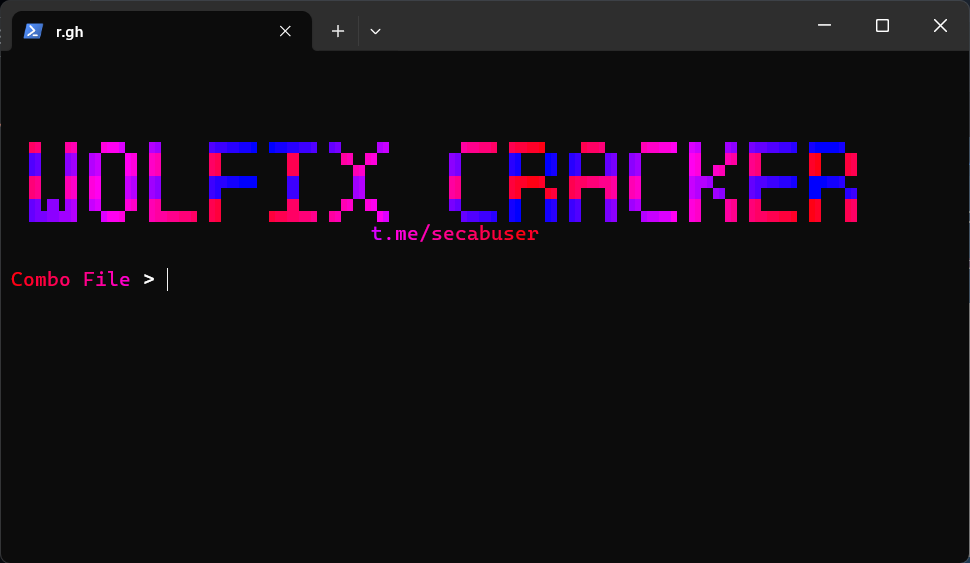

# SmmWolfix Cracker 



---

## Features

  - **Fast**
  - **100% Accurate**
  - **Check Access**
  - **Proxy Support**

-----

## How to Use

### Windows

#### Step 1: Install Python

1.  Download Python from [https://www.python.org/](https://www.python.org/) and install it.
2.  During installation, ensure **Add Python to PATH** is selected.
3.  Verify installation by opening `cmd` and typing:
    ```cmd
    python --version
    ```

#### Step 2: Install Required Libraries

1.  Open Command Prompt (`cmd`).
2.  Install libraries:
    ```cmd
    pip install -r requirements.txt
    ```
    \*(**Note:** You'll need to create a `requirements.txt` file in the same directory as your script. It should contain the following lines for the libraries we've used:
    ```
    requests[socks]
    beautifulsoup4
    pystyle
    colorama
    ```
    )\*

#### Step 3: Prepare Input Files

  - **Combo File**: Create a file with `<user>:<password>` format. Example:
    ```
    twotran:anhTu0411!
    user:password
    ```
  - **Proxy File**: Create a file with one proxy per line. Example:
    ```
    http://51.79.99.237:4502
    http://159.203.61.169:80
    socks5://128.199.202.122:1080
    socks4://72.195.34.35:27360
    ```

#### Step 4: Run the Script

Execute the script:

```cmd
python main.py
```

#### Step 5: Follow the Prompts

Provide the requested information:

1.  **Path to the Combo File.**
2.  **Choose Use Proxy (yes or no)**.
3.  **Enter Max Worker Count.**
4.  **Enter Sleep** (delay in seconds).

#### Step 6: Check Results

After completion, logs are generated in the following files:

  - `good.txt` (for successful logins)
  - `error.txt` (for accounts that encountered technical errors)
  - `bad.txt` (for failed logins due to incorrect credentials)

Open these files using Notepad or any text editor to view results.

-----
